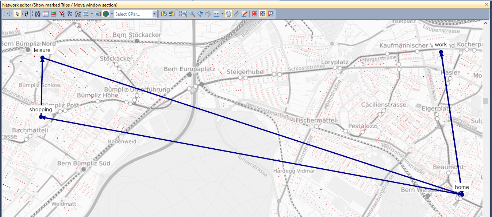
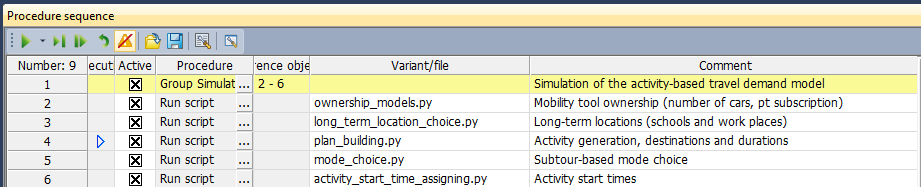

Activity-based modelling in PTV Visum
================

``ABM-in-Visum`` is a collaborative project initiated by [Swiss Federal Railways (SBB)](https://www.sbb.ch/) and [PTV Group](https://company.ptvgroup.com/).

It provides the core functionality to simulate an *activity-based travel demand model* within the [PTV Visum software](https://www.ptvgroup.com/en/solutions/products/ptv-visum/). In addition to the core functionality (see ``engines``), user-specific model implementations (see ``model-contribs``) are given.

## Overview & history

The repository ``ABM-in-Visum`` targets to offer a collection of algorithms and scripts which allow the user to simulate a full activity-based travel demand model within the [PTV Visum software](https://www.ptvgroup.com/en/solutions/products/ptv-visum/). The output is a microscopic, activity-based daily mobility schedule for each person in the synthetic population, which is consistent in time (seconds) and space (x/y-coordinates). The resulting schedules can be used for network assignment or also, for agent-based simulation (e.g. using the [MATSim software](https://www.matsim.org/)). It requires three main inputs, 1) a synthetic population including a person database and locations where they live as well as where they can perform activities, 2) parameters to simulate the choices (e.g. the probability of performing a work activity), and 3) level of service skim matrices (e.g. travel times for all available modes). Input generation and parameter estimation is not part of this repository ``ABM-in-Visum``.

The work on this project started back in 2018 as a collaboration between `Chetan Joshi` from `PTV Group` and `SBB` (`Wolfgang Scherr` and `Patrick Manser`). After SBB released their first fully calibrated activity-based model in 2019, `PTV Group` (initiated and guided by `Klaus Nökel` and `Martin Snethlage`) implemented an efficient data structure for an activity-based demand model in the PTV Visum software, which was released in version 2020. In addition to the data structure, PTV offers the necessary scripts to run a small example within PTV Visum as well as an efficient solution to simulate the computationally expensive location choice step.

``ABM-in-Visum`` publishes the scripts and algorithms which are used in the example model of PTV and the large-scale application of SBB. Not published are parameters and inputs of SBBs' model. The goal is to make the models more accessible and it opens the possibility to make contributions for every user.

## Functionality

The funcionality in this repository an be divided into the two components:
1) ``engines`` - the purpose of this component is having a central place for very general core functionality. For now, it contains:
   - ``location choice engine``: Engine for long-term location choice including an *iterative fitting*-algorithm as well as secondary destination choice including the *rubber-banding* method. Also, the software allows simulating large-scale scenarios (8'000 choice alternatives) using parallel computing.
   - ``simple discrete choice engine``: Engine to simulate simple two-dimensional discrete choice models based on random draws.
2) ``model-contribs`` - this folder contains user-specific model contributions, which can used as example for different implementations of the core engines: 
   - ``sbb-mobi-plans``: Full activity-based travel demand model as it is applied at Swiss Federal Railways (SBB). SBB simulates the model for all inhabitants of Switzerland (8.6Mio.) and uses 8'000 traffic zones for location and destination choice. Also, it is already applied to forecast travel demand of 2030 and 2040.
   - ``ptv-simple-example``: about to come...

All scripts rely on having a synthetic population in the PTV Visum data structure including a person table (with socio-demographic attributes and household membership) as well as a location table (household residences and other activity locations). This repository does not provide the functionality to generate a synthetic population. Also, it does not contain the functionality to estimate parameters required to run the choice models.

## Usage

The usage of the scripts available in this repository requires a license for the [PTV Visum software](https://www.ptvgroup.com/en/solutions/products/ptv-visum/). PTV Visum offers the efficient data structures that are necessary to manage, store and visualize activity-based travel demand (released in version 2020).

Within the PTV Visum software, the procedure sequences allows to execute to provided Python scripts. The following figure shows an example of a complete procedure sequence for a activity-based model (as provided in ``model-contribs/sbb-mobi-plans``):

## Collaboration

We are very happy to include any motivated collaborator. Just `clone` or `fork` ``ABM-in-Visum`` and extend it by your own contributations (either in the ``engines`` or as your own ``model-contribs``). In the case of a `clone`, you are welcome to work on your own branch within this repository. Then, come back with a pull request on the branch ``main`` - it will be reviewed by the repository admins and provided to all the other users of the repository after the merge.

## Additional information & literature

- PTV Visum Webinar: [Activity Based Modelling with PTV Visum](https://www.youtube.com/watch?v=HvxDVKPmS-s)
- Scherr, W., Manser, P., Joshi, C., Frischknecht, N., & Métrailler, D. (2020). Towards agent-based travel demand simulation across all mobility choices – the role of balancing preferences and constraints. *European Journal of Transport and Infrastructure Research*, 20(4), 152-172. (https://doi.org/10.18757/ejtir.2020.20.4.4463).
- Scherr, W., Manser, P., Bützberger, P. (2020). SIMBA MOBI: Microscopic Mobility Simulation for Corporate Planning. *Transportation Research Procedia*, 49, 30-43. (https://doi.org/10.1016/j.trpro.2020.09.004).
- Hillel T., Pougala, J., Manser, P., Luethi, R., Scherr,  W., Bierlaire, M. (2020). Modelling mobility tool availability at a household and  individual level; A case study of Switzerland. *Proceedings of the 9th Symposium of the European  Association for Research in Transportation (HEART)*. (https://transp-or.epfl.ch/heart/2020/abstracts/HEART_2020_paper_138.pdf).

-----

Licensing
=========
``ABM-in-Visum`` is licensed under the Apache License, Version 2.0. See
[LICENSE](https://github.com/SchweizerischeBundesbahnen/abm-in-visum/blob/main/LICENSE) for the full
license text.

This license does not grant permission to use the trade names, trademarks, service marks, or names of the Licensors (SBB, PTV Group), except as required for reasonable and customary use in describing the origin of the work and reproducing the content of the copyright notice.

