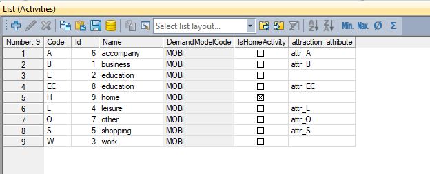
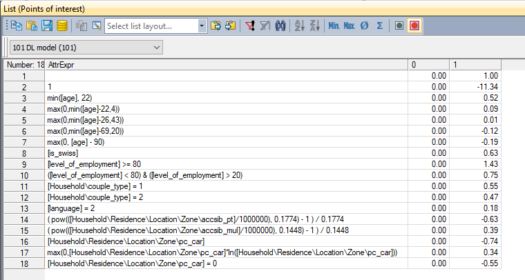
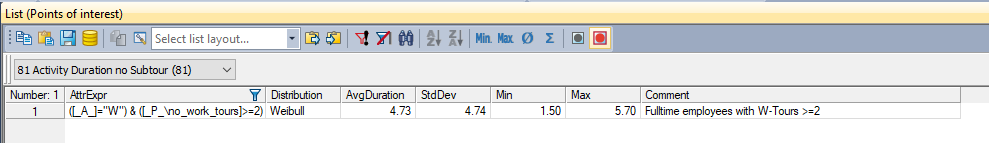

MOBi.plans: SBBs' activity-based demand model
================

 ## Available scripts

Full activity-based demand model procedure ``scripts\simulate_full_mobi_plans.py``, which contains all choice steps that are simulated in MOBi.plans.

Also, the individual choice steps are available as separate scripts:
- ``scripts\ownership_models.py``: simulation of mobility tool ownership choice
- ``scripts\long_term_location_choice.py``: simulation of long-term location choices (e.g., work place)
- ``scripts\plan_building.py``: simulation of activity generation as well as activity duration and destination choice in an iterative procedure based on time budgets
- ``scripts\mode_choice.py``: simulation of a subtour-based mode choice depending on mode-specific impedance parameters
- ``scripts\activity_start_time_assigning.py``: simulation of activity start time choice based on time of day distributions

## Switzerland scenario

MOBi.plans simulates every inhabitant of Switzerland who is older than 5 years. In the existing state (2017), the model has the following size:
- *Zones*: 8'000
- *Locations*: 2.2 Mio.
- *Households*: 3.8 Mio.
- *Persons*: 8.6 Mio.
- *Tours*: 12 Mio.
- *Activity executions*: 37 Mio.

## Activity types

MOBi.plans uses 9 activity types including the *home* and the primary activities *work* and *education* as shown in the following table:

## MOBi.plans ABM procedure

The figure below shows the full ABM procedure as simulated in MOBi.plans including all choice models and their segmentations:

 
 ## Choice parameters

 SBB does not publish the individual choice parameters. The following two figures show two examples. The first one is a simple discrete discrete choice model (driving license ownership [true,false]), the second is an example for activity duration distributions.

